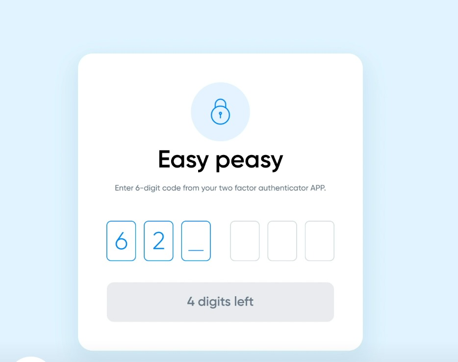
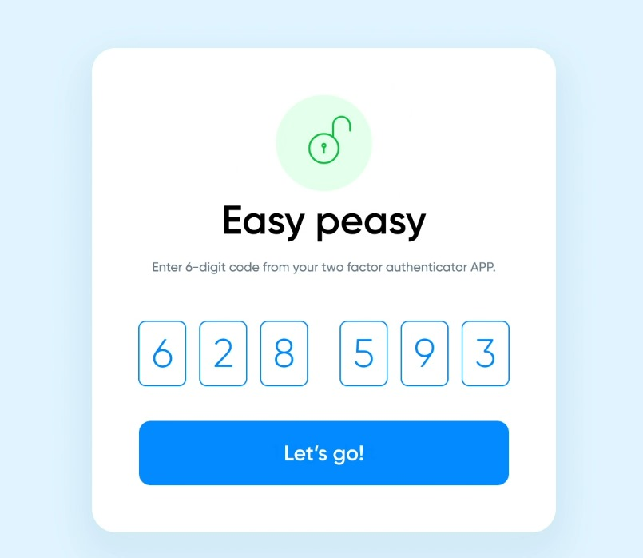

# Two-Factor Authentication Component

A beautiful, responsive, and accessible Two-Factor Authentication (2FA) component built with SvelteKit and Tailwind CSS. Features smooth animations, comprehensive keyboard navigation, and production-ready security considerations.

## 📸 Demo & Screenshots

### 🎥 Video Demo


*Watch the complete demonstration of the Two-Factor Authentication component in action*

### 📱 Screenshots

#### Base State

*Clean, modern interface in the default state*

#### Success State

*Visual feedback when authentication is successful*

#### Error State

*Clear error indication for invalid codes*

## ✨ Features

### 🎨 **Visual Design**
- Modern, clean interface with smooth animations
- Responsive design that works on all devices
- Status-based color coding (default, success, error)
- Animated pulse waves for visual feedback
- Smooth digit drop animations
- Custom cursor animations with slide-up effect

### 🚀 **User Experience**
- **Keyboard Navigation**: Full arrow key, backspace, and tab support
- **Paste Support**: Ctrl+V and right-click paste functionality
- **Auto-advance**: Automatically moves to next field after input
- **Auto-submit**: Submits when all 6 digits are entered
- **Error Handling**: Visual feedback for invalid codes
- **Loading States**: Smooth loading animations during verification

### ♿ **Accessibility**
- Screen reader compatible
- High contrast mode support
- Keyboard-only navigation
- Focus management
- ARIA labels and descriptions
- Semantic HTML structure

### 🔧 **Developer Experience**
- TypeScript support ready
- Comprehensive API
- Customizable validation
- Event callbacks
- Easy integration
- Well-documented code

## 🎯 Assignment Completion

This Two-Factor Authentication component was developed as part of a **Frontend Developer Assessment** challenge. The task was to build a functional 2FA component using JavaScript and Svelte, focusing on:

- ✅ Modern UI/UX design
- ✅ Smooth animations and transitions
- ✅ Comprehensive keyboard navigation
- ✅ Accessibility compliance
- ✅ Mobile responsiveness
- ✅ Production-ready code quality

**Assessment Requirements Met:**
- **Framework**: Built with SvelteKit
- **Styling**: Tailwind CSS with custom animations
- **Functionality**: Complete 2FA input handling
- **User Experience**: Intuitive and accessible interface
- **Code Quality**: Clean, documented, and maintainable code

*See the `screenshots/Frontend Developer Assesment.pdf` for the original assignment details.*

## 📦 Installation

### Prerequisites
- Node.js 18+ 
- npm/yarn/pnpm

### Setup

1. **Clone the repository**
```bash
git clone https://github.com/Sanskargupta0/Two-Factor-Authentication-component.git
cd Two-Factor-Authentication-component
```

2. **Install dependencies**
```bash
npm install
# or
yarn install
# or
pnpm install
```

3. **Start development server**
```bash
npm run dev
# or
yarn dev
# or
pnpm dev
```

4. **Open in browser**
```
http://localhost:5173
```


### Events

| Event | Payload | Description |
|-------|---------|-------------|
| `success` | `{ code: string }` | Fired on successful verification |
| `error` | `{ code: string, attempts: number }` | Fired on verification failure |
| `input` | `{ code: string, isComplete: boolean }` | Fired on each input change |
| `paste` | `{ code: string }` | Fired when code is pasted |
| `reset` | None | Fired when component is reset |

## 🎨 Customization

### Styling

The component uses Tailwind CSS and CSS custom properties for easy customization:

```css
/* Custom CSS variables */
:root {
  --2fa-primary-color: #007AFF;
  --2fa-success-color: #34C759;
  --2fa-error-color: #FF3B30;
  --2fa-background-color: #F0F7FF;
  --2fa-input-border: #D1D5DB;
  --2fa-input-size: 48px;
  --2fa-border-radius: 8px;
}
```

### Animation Timing

```css
/* Customize animation durations */
:root {
  --2fa-drop-duration: 300ms;
  --2fa-cursor-duration: 300ms;
  --2fa-pulse-duration: 2s;
  --2fa-shake-duration: 400ms;
}
```

### Responsive Breakpoints

```css
/* Mobile optimizations */
@media (max-width: 480px) {
  --2fa-input-size: 42px;
  --2fa-font-size: 24px;
  --2fa-gap: 8px;
}
```


### Test Coverage

The component includes comprehensive tests for:

- ✅ User input validation
- ✅ Keyboard navigation
- ✅ Paste functionality
- ✅ Error handling
- ✅ Animation states
- ✅ Accessibility features
- ✅ Edge cases

### Manual Testing Checklist

#### Functionality
- [ ] Can enter digits 0-9
- [ ] Rejects non-numeric input
- [ ] Auto-advances between fields
- [ ] Backspace clears and moves back
- [ ] Arrow keys navigate correctly
- [ ] Paste works with Ctrl+V and right-click
- [ ] Auto-submits when complete
- [ ] Shows loading state during verification
- [ ] Displays success/error states

#### Accessibility
- [ ] Keyboard navigation works
- [ ] Screen reader announces changes
- [ ] Focus management is correct
- [ ] High contrast mode works
- [ ] Tab order is logical

#### Visual
- [ ] Animations are smooth
- [ ] Responsive on mobile
- [ ] Colors match design system
- [ ] Loading states are clear
- [ ] Error states are obvious

## 🌐 Browser Support

| Browser | Version | Status |
|---------|---------|--------|
| Chrome | 90+ | ✅ Fully supported |
| Firefox | 88+ | ✅ Fully supported |
| Safari | 14+ | ✅ Fully supported |
| Edge | 90+ | ✅ Fully supported |
| iOS Safari | 14+ | ✅ Fully supported |
| Android Chrome | 90+ | ✅ Fully supported |

### Feature Support

- **CSS Grid/Flexbox**: Required
- **CSS Custom Properties**: Required
- **Clipboard API**: Required for paste functionality
- **ES6+ Features**: Required

## 📱 Mobile Optimization

### Touch Targets
- Minimum 44px touch target size
- Optimized spacing for thumb navigation
- Responsive font sizes

### Virtual Keyboard
- Numeric input mode on mobile
- Prevents zooming on input focus
- Optimized for various keyboard layouts

### Performance
- Optimized animations for 60fps
- Minimal JavaScript bundle size
- Efficient DOM updates

## 🔧 Development

### Project Structure

```
src/
├── lib/
│   └── components/
│       └── TwoFactorAuth.svelte    # Main component
├── routes/
│   └── +page.svelte                # Demo page
├── app.css                         # Global styles
└── app.html                        # HTML template

tests/
├── unit/                           # Unit tests
├── integration/                    # Integration tests
└── e2e/                           # End-to-end tests
```

### Development Workflow

1. **Make changes** to component
2. **Test locally** with `npm run dev`
3. **Run tests** with `npm test`
4. **Check accessibility** with browser tools
5. **Test on multiple devices**
6. **Update documentation** if needed

### Contributing

1. Fork the repository
2. Create a feature branch
3. Make your changes
4. Add tests for new functionality
5. Update documentation
6. Submit a pull request

## 📝 Changelog

### v1.0.0 (Latest)
- ✨ Initial release
- 🎨 Complete UI/UX implementation
- ♿ Full accessibility support
- 📱 Mobile optimization
- 🧪 Comprehensive test suite
- 📚 Complete documentation

## 📄 License

MIT License - see [LICENSE](LICENSE) file for details.

---

Made with ❤️ by [Sanskar Gupta](https://github.com/Sanskargupta0)
